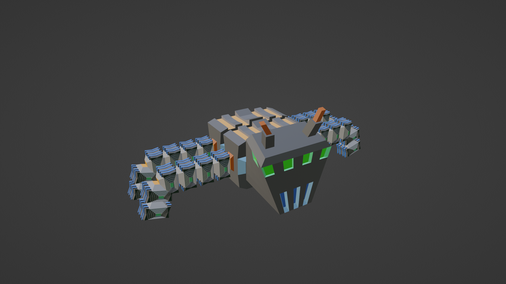
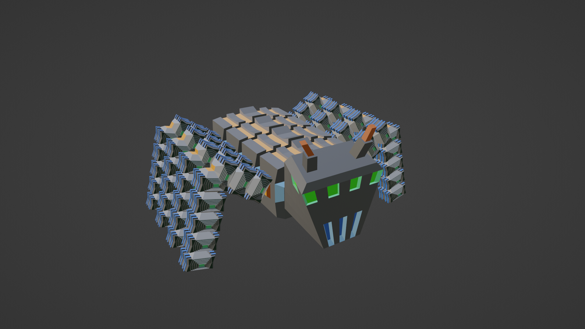

# Procedural Robot Modelling using Blender

This is part 1 of the a project made by [akua21](https://github.com/akua21) and [Pheithar](https://github.com/Pheithar) for the course 02563 Generative Methods for Computer Graphics at DTU in Spring of 2023. The project consisted in creating a procedurally generated 3D model of a 'Robotic' ant and later animate in Unity. We decided to use Blender Geometry nodes to create the design that can be randomized from a seed, or set specific parameters from it.

## Image examples


_Example of a pose generated by the script using as seed 42_


_Example of a pose generated by the script using as seed 555_

## Extended Abstract

As part of the course, we where asked to write an extended abstract of the project. You can find it in [Procedural Pipeline: Procedural 3D character design using Blender](./readme_files/Procedural_Modelling.pdf).

_Note: Although the author of the abstract is indicated solely as Alejandro Valverde Mahou ([Pheithar](https://github.com/Pheithar)) the work was done by both authors._

## Quick run script command

```bash
blender blend_file.blend --background --python script.py
```

To use the preapared script:

```bash
blender -b dataflow.blend -P scripts/CreateAntBot.py -- 42
```
